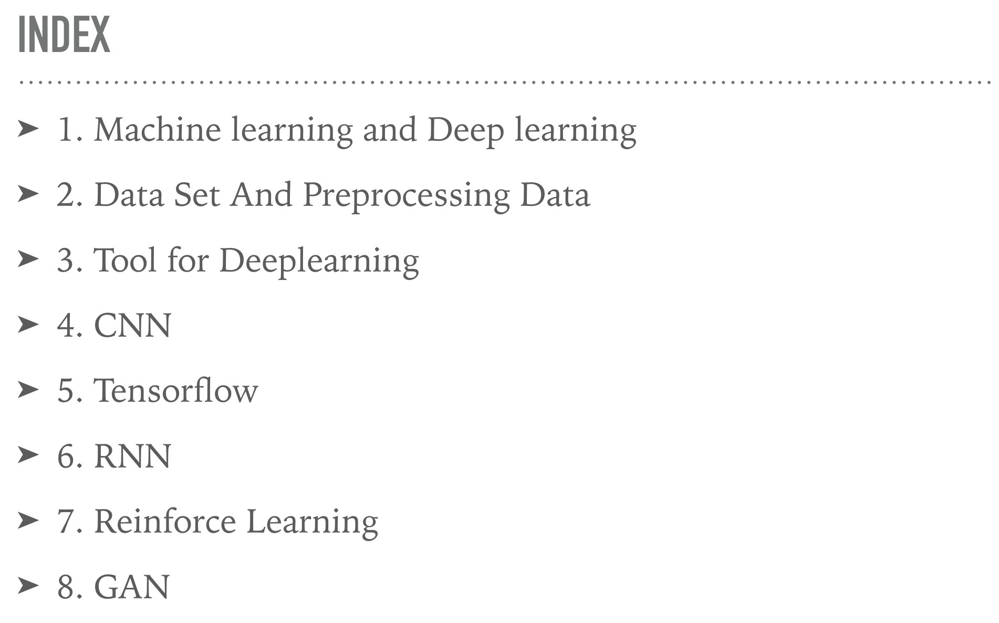
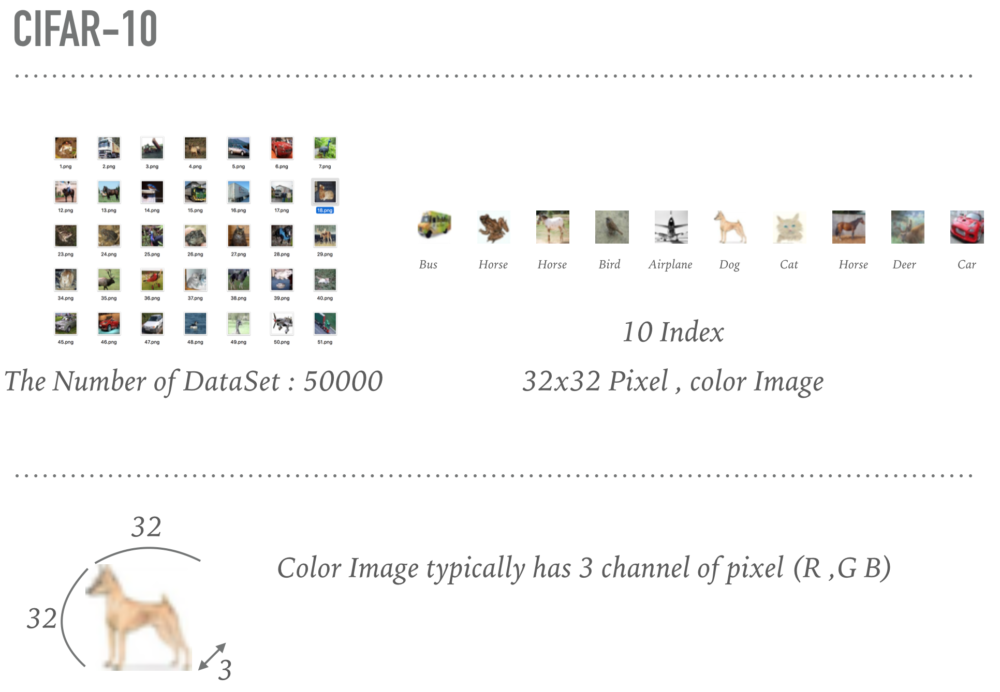

# learning_tensorflow

- cifar_fully_connected_model.ipynb : fully connected model
- cifar-convolution.ipynb : 2 convolution layers
- cifar-deep-convolution.ipynb : 4 convolution layers + 2 max pooling
- cifar-deep-convolution-block-overfitting.ipynb : 4 convolution layers + 2 max pooling + dropout + data augmentation
- preprocessing.py : cifar data loading and preprocessing

# Mediwhale

